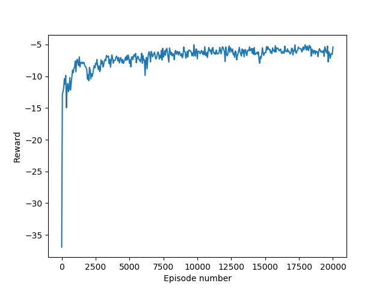
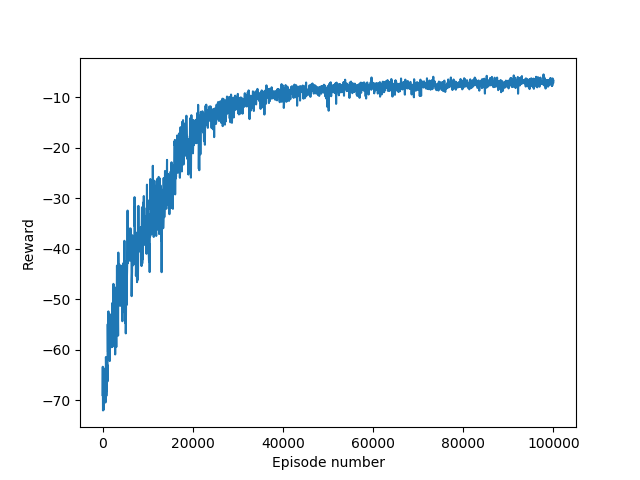

# Branching Dueling Q-Network

A deep reinforcement learning algorithm is used to solve the reacher benchmark problem. 

The Branching Dueling Q-Network (BDQ) is a branching variant of the Dueling Double Deep Q-Network (Dueling DDQN).
The code was adapted (and simplified) from [here](https://github.com/atavakol/action-branching-agents). The paper can be found [here](https://arxiv.org/abs/1711.08946).

## Supporting video

2 DOF reacher after 20,000 training episodes:

[](http://www.youtube.com/watch?v=bh0N1RJ8adA)


6 DOF reacher after 100,000 training episodes:

[](http://www.youtube.com/watch?v=LFsdrXT47Ho)


## Getting started

### Requirements

`python 3.7.3`

`gym 0.9.1`

`tensorflow 1.14.0`

`mujoco_py 0.5.7`

### Installation

```
git clone https://github.com/PierreExeter/BDQ_for_reacher.git
```

### Train

Run the script `train_continuous.py`

### Evaluate

Open the script `enjoy_continuous.py`

Select the trained model from the `trained_models` folder.

Run the script `enjoy_continuous.py`

